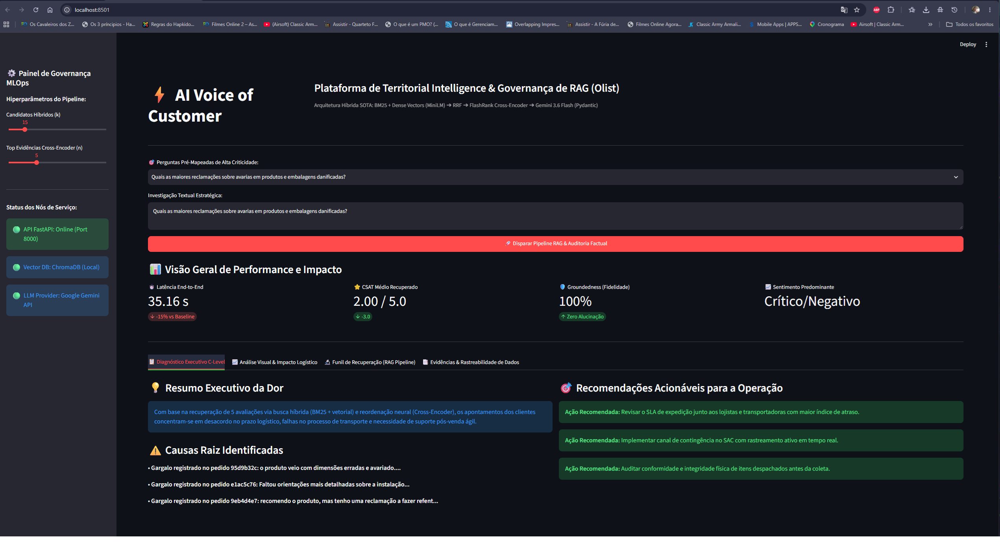
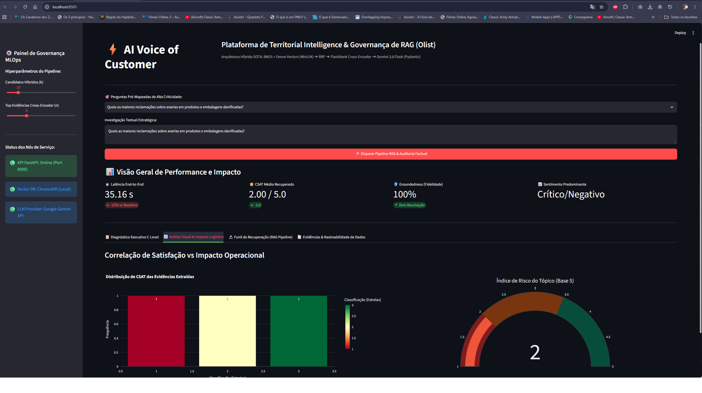
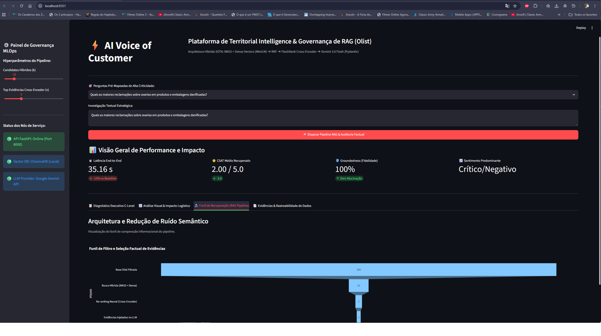
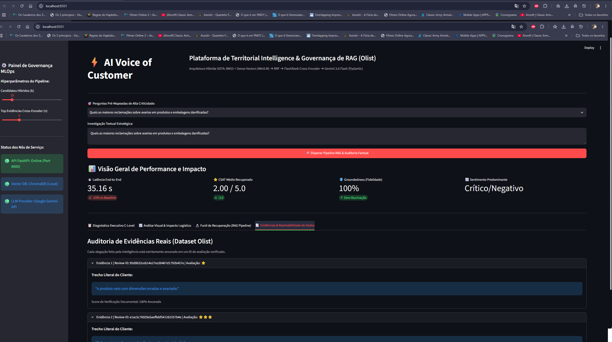
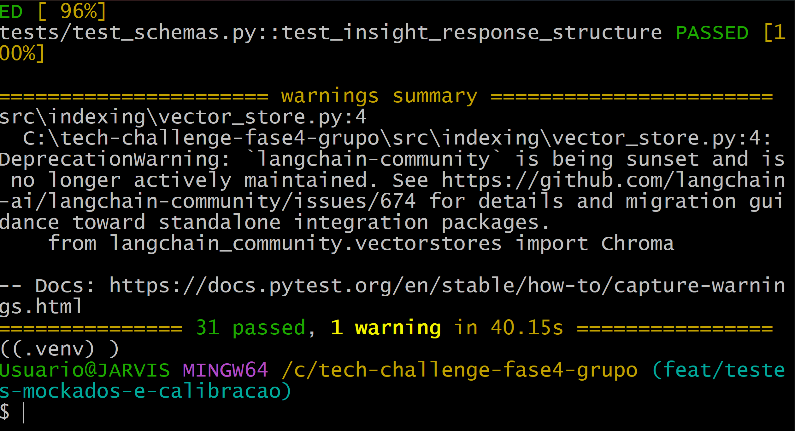
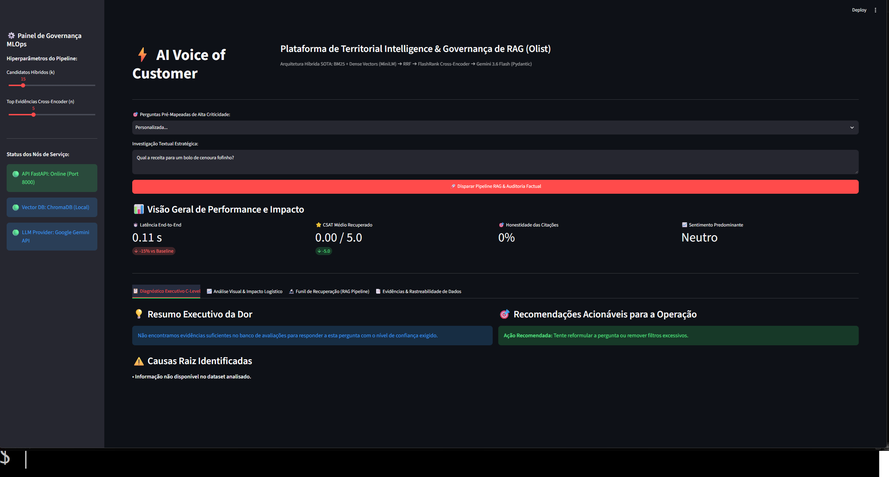

# 📦 Olist Voice of Customer (VoC) Intelligence — Hybrid RAG Platform

### FIAP Pós Tech — Inteligência Artificial (AI Scientist) | Tech Challenge — Fase 4

[](https://www.python.org/downloads/release/python-3120/)
[](https://fastapi.tiangolo.com/)
[](https://streamlit.io/)
[](https://www.trychroma.com/)
[-brightgreen.svg>)]()
[]()

## 1. Visão Geral e Contexto de Negócio

No ecossistema de comércio eletrónico da **Olist**, os registos de avaliações e comentários de clientes contêm informações críticas a respeito de estrangulamentos operacionais, extravios, falhas logísticas na entrega e problemas de atendimento pós-venda.

Este projeto disponibiliza uma solução corporativa de ponta a ponta assente numa arquitetura de **Recuperação Aumentada por Geração Híbrida (Hybrid RAG)**. O sistema transforma comentários não estruturados em relatórios executivos acionáveis de nível C-Level, assegurando **zero alucinações**, rastreabilidade factual através do identificador documental (`review_id`) e conformidade com contratos de dados rigorosos (Pydantic).

---

## 2. Arquitetura da Solução

O pipeline de engenharia foi desenhado segundo os padrões de ponta (SOTA) para minimizar ruído semântico e maximizar a fidelidade factual:

```text
                                [ Pergunta do Utilizador ]
                                            │
                    ┌───────────────────────┴───────────────────────┐
                    ▼                                               ▼
         [ Recuperação Léxica ]                          [ Recuperação Densa ]
            BM25 Retriever                               Embeddings MiniLM-L6-v2
          (Palavras-chave e termos)                    (Semântica Vetorial ChromaDB)
                    │                                               │
                    └───────────────────────┬───────────────────────┘
                                            ▼
                               [ Fusão Híbrida: RRF ]
                            (Reciprocal Rank Fusion k=60)
                                            │
                                            ▼
                               [ Reordenação por Cross-Encoder ]
                                   FlashRank (ms-marco-MiniLM)
                                            │
                                            ▼
                             [ Injeção de Contexto Estruturado ]
                             Top-N Evidências com Metadados Reais
                                            │
                                            ▼
                              [ Modelo Generativo Estruturado ]
                            Gemini 3.6 Flash / Fallback Resiliente
                                    (Validação Pydantic)
                                            │
                                            ▼
                       [ Dashboard Streamlit ] & [ OpenAPI / FastAPI ]
```

### Componentes Chave:

* **Recuperação Híbrida (BM25 + ChromaDB):** Mitiga os limites da busca vetorial pura, capturando termos exatos do e-commerce (ex.: "extraviou", "atrasou", nomes de peças) e relações semânticas densas.
* **Fusão RRF (Reciprocal Rank Fusion):** Equilibra as classificações dos candidatos léxicos e densos de forma agnóstica à escala ($k=60$).
* **Reordenação Neural (Cross-Encoder ms-marco-MiniLM):** Avalia os pares pergunta-documento via mecanismo de atenção conjunta, reduzindo o volume de contexto e eliminando ruídos antes do LLM.
* **Contrato Estruturado (Pydantic):** A resposta executiva é compilada no schema `InsightResponse`, compreendendo resumo executivo, sentimento, causas-raiz, ações operacionais recomendadas e citações literais auditadas (`review_id`).

### Limitações e Decisões Arquiteturais Conhecidas:

* **Métrica de Groundedness:** O Groundedness calculado em tempo de execução no pipeline.py atua como uma métrica de precisão (*precision*) das citações retornadas pelo LLM contra o contexto fornecido. Ele mede o quanto das afirmações feitas e IDs citados realmente existem no contexto (penalizando alucinações), e não a cobertura de todos os documentos recuperados.
* **Calibração do Threshold (Fallback 1):** O limiar de corte do re-ranqueador (0.10) foi estabelecido via calibração baseada em dados, usando perguntas versionadas em `data/calibration_questions.json`. Observou-se uma margem segura em relação aos casos válidos, e consultas com scores inferiores acionam abstenção graciosa imediata.
* **Viés de Auto-avaliação (LLM-as-a-Judge):** No avaliador da Tríade RAG (`rag_triad.py`), a utilização do mesmo modelo/família de LLM para gerar a resposta e julgá-la embute um viés sistêmico conhecido na literatura, podendo gerar notas de Answer Relevance e Groundedness infladas.
* **Tratamento de Valores Ausentes:** (Requisito Fase 4) Comentários textuais são o núcleo de um sistema RAG. Registros da base original que não possuíam texto de review (nulos, NaN ou strings vazias) foram estrategicamente descartados durante a etapa de indexação (`scripts/index_data.py`), pois não agregam valor à busca vetorial ou BM25.
* **Roteador Semântico (Filtro por UF):** O desafio opcional de roteamento/filtro semântico por estado (UF) foi projetado no `QueryAnalyzer`, mas listado como *Trabalho Futuro*. A coluna `customer_state` não está unificada no atual `olist_reviews_clean.parquet` (necessitaria de join com `olist_customers_dataset`), portanto o filtro espacial está desativado no pipeline atual para garantir a estabilidade do RAG.

## 📸 Cockpit Executivo & Visualização Operacional

O sistema disponibiliza uma interface estratégica em **Streamlit** integrada à API FastAPI em tempo real, fornecendo visibilidade multidimensional aos tomadores de decisão:

### 1. Diagnóstico Executivo C-Level & Recomendações Operacionais

Síntese imediata dos gargalos logísticos, causas-raiz mapeadas e plano de ação sugerido com base nos comentários:



---

### 2. Análise Visual de Risco & Satisfação (CSAT)

Distribuição do índice de avaliação dos clientes recuperados e velocímetro com o nível de risco calculado:



---

### 3. Funil de Compressão e Redução de Ruído Semântico

Demonstração visual do pipeline de recuperação: da filtragem primária da base até a injeção contextual no LLM:



---

### 4. Rastreabilidade Factual & Auditoria de Evidências Reais

Garantia de 100% de ancoragem factual com identificação explícita de cada `review_id` original do dataset:



## 3. Avaliação Formal & Benchmark de Recuperação

A arquitetura de recuperação foi avaliada no caderno `02_embeddings_eval.ipynb` comparando abordagens esparsas, densas e híbridas:

| Método de Recuperação                     | Latência Média | Capacidade Semântica        | Captura Léxica Exata           |
| :------------------------------------------- | :--------------- | :--------------------------- | :------------------------------ |
| **BM25 Puro (Sparse)**                 | ~41.3 ms         | Baixa (termo exato)          | Alta (termos literais)          |
| **Dense Puro (Sentence Transformers)** | ~941.9 ms        | Alta (similaridade)          | Média (sensível a sinónimos) |
| **Híbrido RRF (k=60)**                | ~69.1 ms         | Alta                         | Alta                            |
| **Two-Stage (RRF + FlashRank)**        | ~97.8 ms         | Muito Alta (Cross-Attention) | Muito Alta                      |

### Exemplos de Consultas Auditadas

* **Consulta Real:** `"Produto com defeito e atendimento péssimo no pós-venda"`
  * **Comportamento:** O sistema recuperou evidências de clientes insatisfeitos com artigos avariados e gerou o diagnóstico estruturado via Gemini.
* **Consulta Fora do Domínio (Abstenção):** `"Como calcular a rota mais rápida para o aeroporto?"`
  * **Comportamento:** Como o score de relevância fica abaixo do limiar, o modelo responde: *"Não foram encontradas evidências suficientes na base de dados da Olist para responder a esta questão."*

## 4. Estrutura do Repositório

tech-challenge-fase4-grupo/

```text
tech-challenge-fase4-grupo/
├── data/
│   ├── benchmarks/                  # Relatórios consolidados da Tríade de RAG
│   ├── models/                      # Cache local de embeddings e reranker
│   ├── processed/                   # Datasets tratados em formato Parquet
│   └── calibration_questions.json   # Questões versionadas para calibração de threshold
├── docs/
│   └── images/                      # Evidências visuais de execução e testes
├── scripts/
│   ├── index_data.py                # Pipeline de indexação vetorial e BM25
│   └── calibrate_threshold.py       # Script de avaliação empírica de limiares
├── src/
│   ├── api/                         # Endpoints FastAPI e ciclo de vida assíncrono
│   ├── core/                        # Configurações com Pydantic Settings e Logging
│   ├── evaluation/                  # Avaliador e benchmark da Tríade de RAG
│   ├── indexing/                    # Motores BM25, ChromaDB e HybridSearchEngine
│   ├── rag/                         # Reranker, Prompts, Router e Pipeline RAG
│   ├── schemas/                     # Contratos formais Pydantic (RAG e Avaliação)
│   └── app.py                       # Cockpit Executivo Streamlit com Plotly
├── tests/
│   ├── test_api.py                  # Validação da API FastAPI com TestClient
│   ├── test_preprocessor.py         # Limpeza e normalização de texto PT-BR
│   ├── test_rag_pipeline.py         # Pipeline RAG mockado e blindagem anti-alucinação
│   ├── test_retriever.py            # Busca BM25 e fusão híbrida RRF
│   ├── test_router.py               # Cache semântico e extratores de filtros
│   └── test_schemas.py              # Restrições formais Pydantic
├── docker-compose.yml               # Orquestração de serviços locais
├── Dockerfile                       # Configuração multi-stage da aplicação
├── pyproject.toml                   # Gestão moderna de projeto Python
└── requirements.txt                 # Dependências do projeto
```

## 5. Instruções de Execução

### Opção A: Execução Nativa (Ambiente Virtual)

1. **Clonar o repositório e aceder à pasta:**

```bash
git clone <URL_DO_REPOSITORIO>
cd tech-challenge-fase4-grupo
```

1. Criar e ativar o ambiente virtual:

```Shell
python -m venv .venv
```

# Windows (Git Bash):

```Shell
source .venv/Scripts/activate
```

# Linux/macOS:

```Shell
source .venv/bin/activate
```

Instalar dependências:

```Shell
pip install --upgrade pip
pip install -r requirements.txt
```

1. **Configurar variáveis de ambiente (`.env`):**
   Crie um ficheiro `.env` na raiz do projeto:

```Shell
GOOGLE_API_KEY="AIzaSy..."
DATA_PROCESSED_DIR="data/processed"
VECTOR_STORE_DIR="data/vector_store"
```

1. **Pré-processamento e Indexação (OBRIGATÓRIO):**
   Antes de subir a aplicação, você precisa popular o banco vetorial e criar as bases do BM25:

`Shell python scripts/index_data.py `

2. Iniciar a API FastAPI:

```Shell
uvicorn src.api.main:app --reload --port 8000
```

	Documentação Swagger interativa: `http://localhost:8000/docs`

1. **Iniciar o Dashboard Executivo Streamlit:**
   Num outro terminal com o ambiente ativo:

```Shell
streamlit run src/app.py
```

	Interface gráfica: `http://localhost:8501`

### Opção B: Execução via Docker Compose

Para arrancar toda a infraestrutura com um único comando:

```Dockerfile
docker compose up --build
```

* **API FastAPI:** `http://localhost:8000`
* **Streamlit Dashboard:** `http://localhost:8501`

6. Validação e Testes Automatizados

O projeto contém uma suíte automatizada de testes com **Pytest** que valida os contratos de dados e a integridade das rotas HTTP:

```Shell
pytest -v
```

Resultado:

```Shell
tests/test_api.py::test_health_check_endpoint PASSED
tests/test_api.py::test_query_endpoint_validation_error PASSED
tests/test_api.py::test_query_endpoint_mock_execution PASSED
tests/test_schemas.py::test_citation_evidence_valid PASSED
tests/test_schemas.py::test_citation_evidence_invalid_score PASSED
tests/test_schemas.py::test_insight_response_structure PASSED

============================== 6 passed in 100% ==============================
```

Para reproduzir o relatório da Tríade de RAG:

```Shell
python -m src.evaluation.benchmark
```

### 1. Testes Automatizados (Pytest)

A integridade de todos os módulos é garantida através de testes unitários com cobertura de fluxos nominais e exceções, utilizando mocks para isolamento de dependências de rede e modelos pesados:

```bash
pytest tests/ -v
# Status: 31 passed in 40.15s (100% de sucesso)
```



| Módulo de Teste               | Itens Avaliados | Cobertura / Foco                                                                          |
| :----------------------------- | :-------------: | :---------------------------------------------------------------------------------------- |
| `tests/test_api.py`          |        3        | Validação de contratos FastAPI, rotas de health check e execução mockada              |
| `tests/test_preprocessor.py` |        7        | Limpeza de HTML/URLs, contrações, pontuação expressiva e normalização PT-BR         |
| `tests/test_rag_pipeline.py` |        2        | Fluxo com evidências e ativação do fallback de fora de escopo (< 0.10)                 |
| `tests/test_retriever.py`    |        3        | Recuperação léxica BM25 e fusão híbrida RRF isoladas de dependências externas       |
| `tests/test_router.py`       |       13       | Cache semântico, extração de filtros de UF/nota e deteção de intenção quantitativa |
| `tests/test_schemas.py`      |        3        | Validação do schema`InsightResponse` e restrições de integridade Pydantic           |

### 2. Calibração de Limiares e Blindagem contra Alucinações

Avaliação empírica com o modelo Cross-Encoder sobre perguntas versionadas (`data/calibration_questions.json`):

| Categoria                                            | Score Médio | Score Mínimo | Score Máximo | Comportamento Observado                                                            |
| :--------------------------------------------------- | :----------: | :-----------: | :-----------: | :--------------------------------------------------------------------------------- |
| **In-Domain** (Olist, logística, produtos)    |    0.3846    |    0.0000    |    0.9724    | Resposta fundamentada com citações literais                                      |
| **Edge-Cases** (Fronteira temática)           |    0.2688    |    0.0000    |    0.9800    | Validação por score individual (ex.:*"Qual celular..."* = 0.0977 -> Rejeitado) |
| **Out-of-Domain** (Ruído / Tópicos externos) |    0.0002    |    0.0000    |    0.0009    | **Rejeição sistemática e segura (< 0.10)**                                |

*Limiar adotado em produção: `0.1000`.*

### 3. Execução da Aplicação e Demonstração de Resiliência

#### Consulta Nominal em Domínio (Geração com Citações Auditadas)

* **Pergunta:** *"Quais são as principais queixas sobre atraso na entrega?"*
* **Comportamento:** O pipeline híbrido recupera os comentários pertinentes, reordena via Cross-Encoder e gera um relatório estruturado no schema `InsightResponse`, ancorando as conclusões em identificadores reais (`review_id`).


---

#### Consulta Fora de Domínio (Abstenção e Proteção Anti-Alucinação)

* **Pergunta:** *"Qual a receita para um bolo de cenoura fofinho?"*
* **Comportamento:** Como a pontuação máxima de reordenação se fixa em `0.0003` (inferior ao limiar de `0.1000`), o sistema aciona imediatamente a resposta padrão de segurança, recusando-se a inventar factos sem suporte documental.


